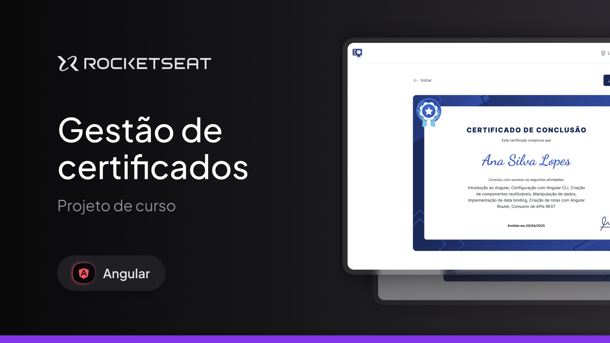
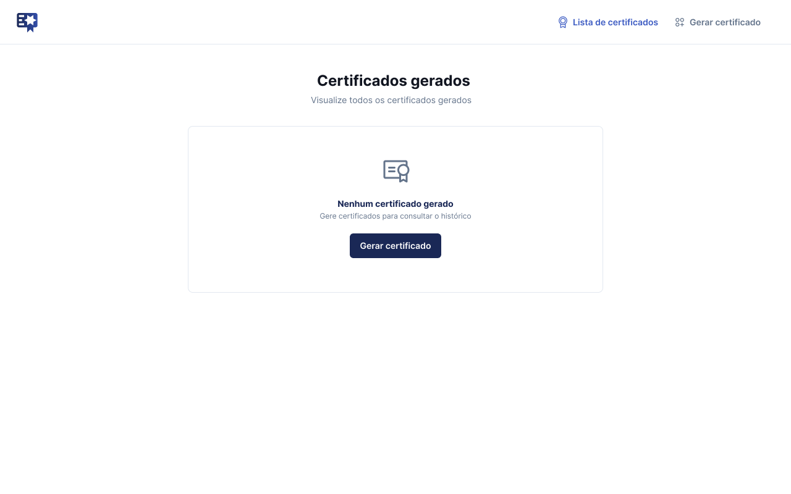
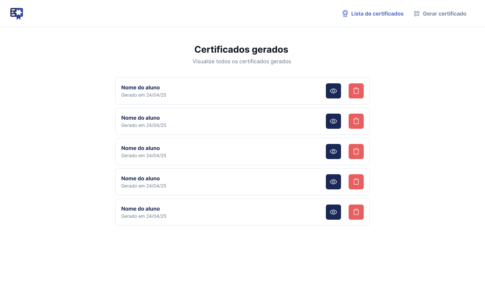
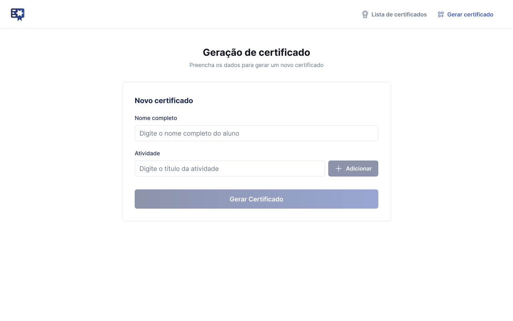
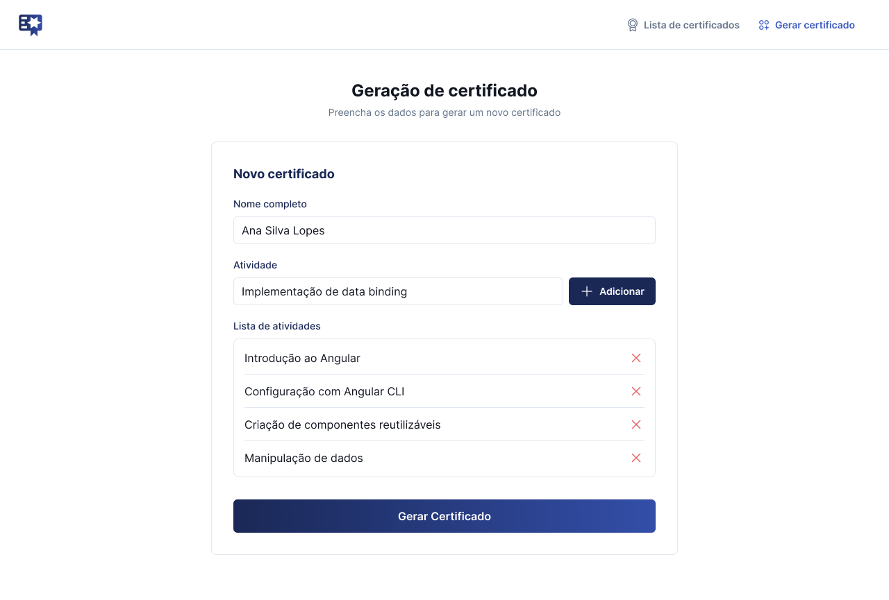
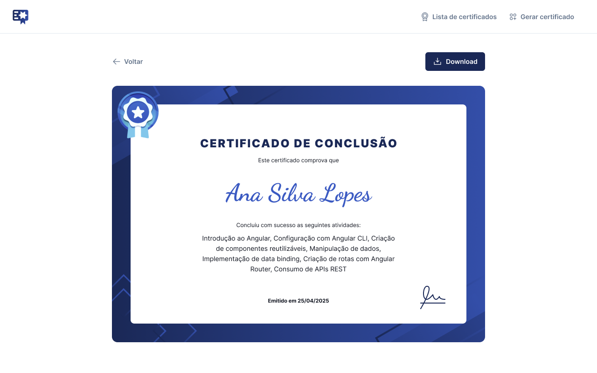

<h1 align="center">
  

  <span>Gerador de Certificados</span>
</h1>

<p align="center">
  

  

  
  
  <a href="https://github.com/pabloxt14/gerador-certificado/commits/master">
    
  </a>
    
   

   <a href="https://github.com/pabloxt14/gerador-certificado/stargazers">
    
  </a>
</p>

<p>
  
</p>

<p align="center">
 <a href="#-about">About</a> | 
 <a href="#-deploy">Deploy</a> |
 <a href="#-layout">Layout</a> | 
 <a href="#-setup">Setup</a> | 
 <a href="#-technologies">Technologies</a> | 
 <a href="#-license">License</a>
</p>


## 💻 About

Esta aplicação de nome **Gestão de Certificados** consiste basicamente em um site de gestão de certificados, com geração, listagem, preview e download de certificações.

Os principais conhecimentos aplicados nesta aplicação foram:
- Criação de sites completos com `Angular`
- Criação de componentes reusáveis com `Angular`
- Gerencia de rotas com `Angular`
- Gerenciamento de estados com `Angular`
- Conversão de HTML para Imagem com `html2canvas`


## 🔗 Deploy

O deploy da aplicação pode ser acessada através da seguinte URL base: https://gerador-certificados-pabloxt14.netlify.app/


## 🎨 Layout

Você pode visualizar o layout do projeto através [desse link](https://www.figma.com/community/file/1508905005736436009/gestao-de-certificados). É necessário ter conta no [Figma](https://www.figma.com/) para acessá-lo.

A seguir, veja uma demonstração das principais telas da aplicação:

### Empty List

<p align="center">
  
</p>

### Certificates List

<p align="center">
  
</p>

### Empty Form

<p align="center">
  
</p>

### Form Filled

<p align="center">
  
</p>

### Certificate Preview

<p align="center">
  
</p>


## ⚙ Setup

### 📝 Requisites

Antes de baixar o projeto você vai precisar ter instalado na sua máquina as seguintes ferramentas:

* [Git](https://git-scm.com)
* [NodeJS](https://nodejs.org/en/)
* [NPM](https://www.npmjs.com/), [Yarn](https://yarnpkg.com/) ou [PNPM](https://pnpm.io/)

Além disto é bom ter um editor para trabalhar com o código como [VSCode](https://code.visualstudio.com/)

### Cloning and Running

Passo a passo para clonar e executar a aplicação na sua máquina:

```bash
# Clone este repositório
$ git clone git@github.com:pabloxt14/gerador-certificado.git

# Instale as dependências
$ npm install

# Inicie o projeto
$ npm run start
```


## 🛠 Technologies

As seguintes principais ferramentas foram usadas na construção do projeto:

- **[Angular](https://angular.dev/)**
- **[TypeScript](https://www.typescriptlang.org/)**
- **[TailwindCSS](https://tailwindcss.com/)**
- **[DayJS](https://day.js.org/)**
- **[HTML2Canvas](https://html2canvas.hertzen.com/)**


> Para mais detalhes das dependências gerais da aplicação veja o arquivo [package.json](./package.json)


## 📝 License

Este projeto está sob a licença MIT. Consulte o arquivo [LICENSE](./LICENSE) para mais informações

<p align="center">
  Feito com 💜 por Pablo Alan 👋🏽 <a href="https://www.linkedin.com/in/pabloalan/" target="_blank">Entre em contato!</a>  
</p>
